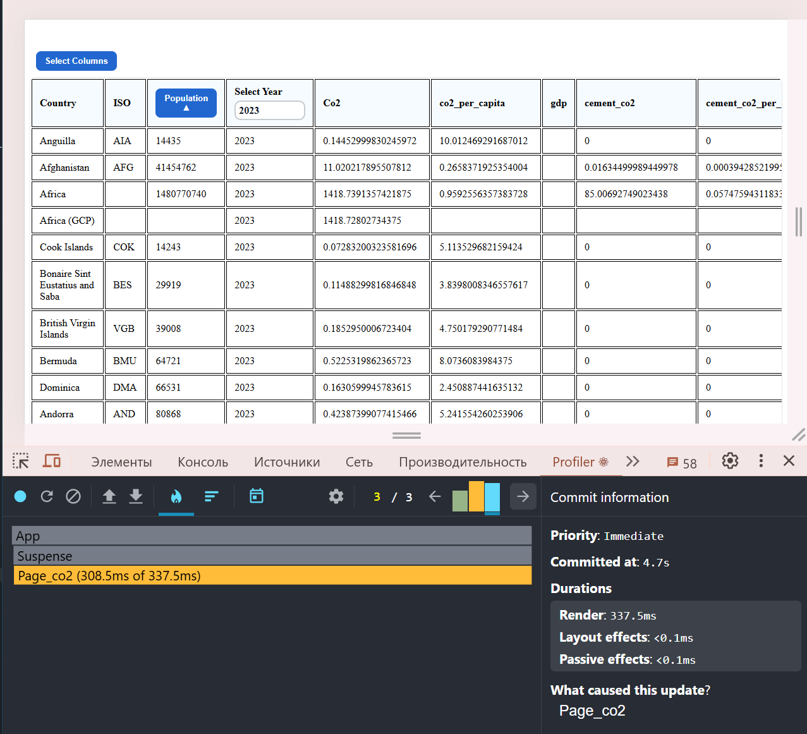
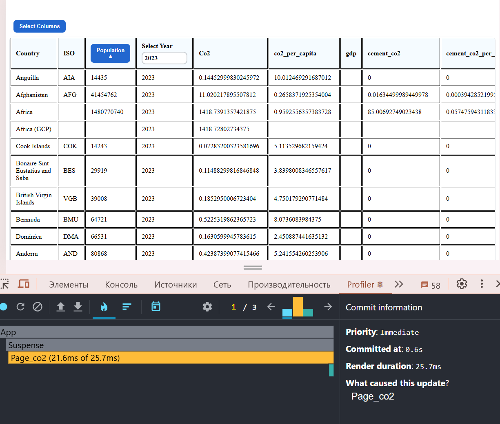
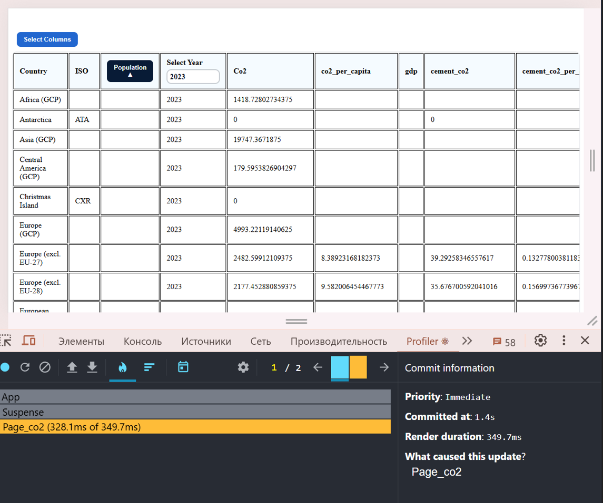
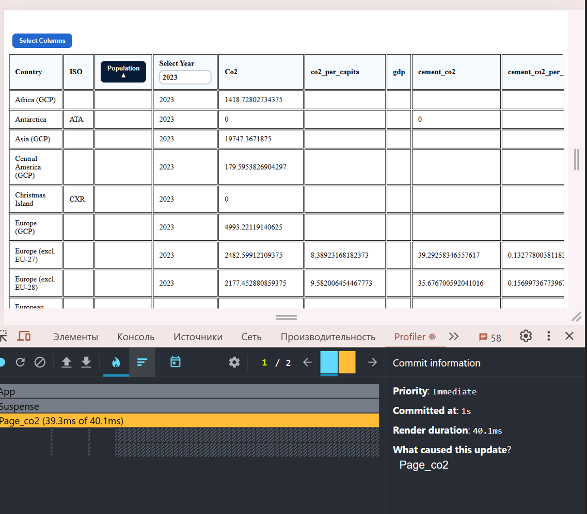
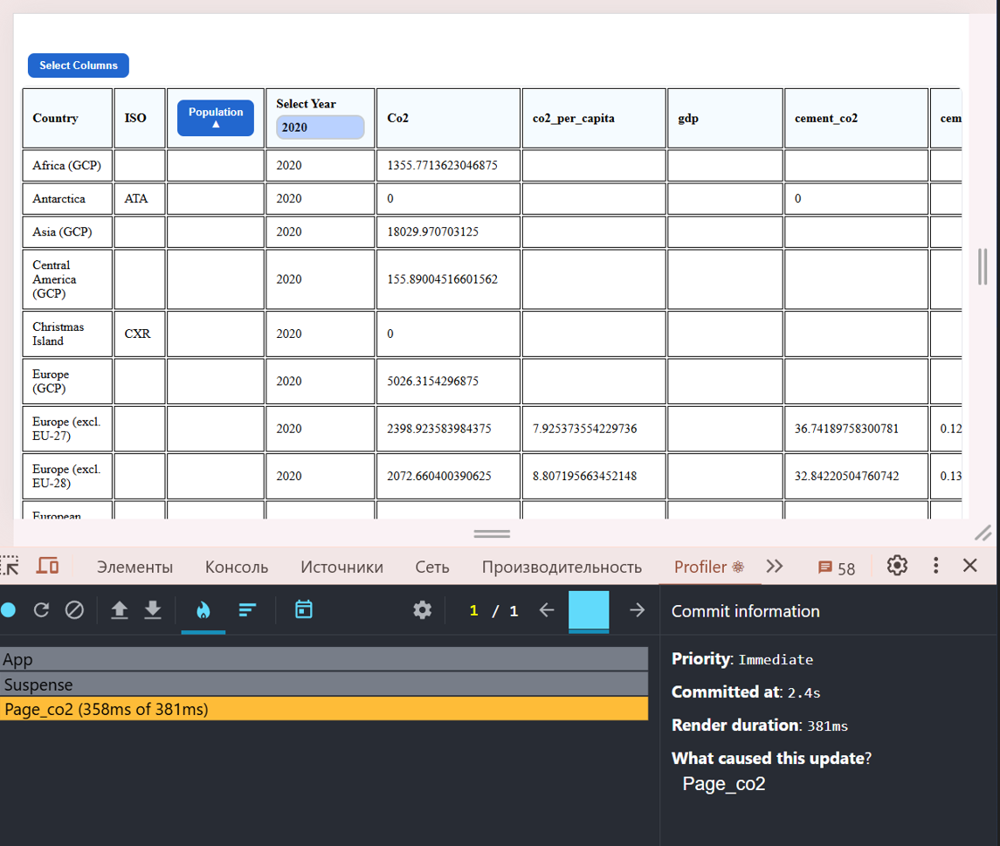
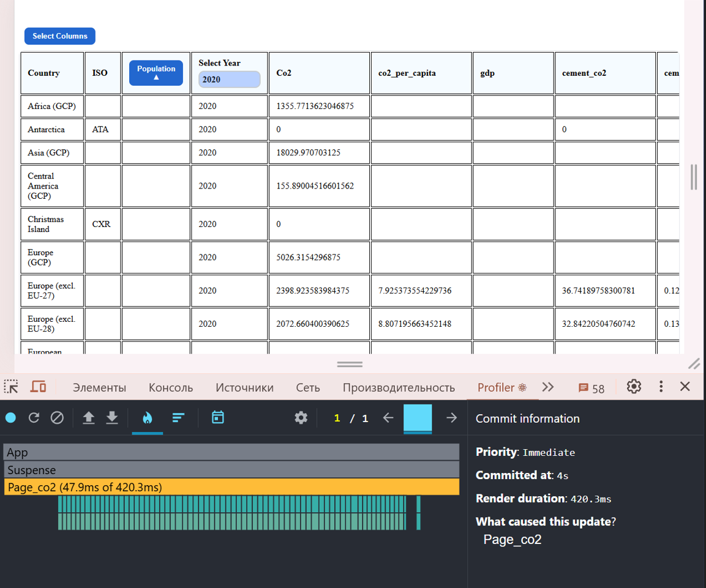

# Performance Profiling (React DevTools Profiler)

## Tested interactions

- Sorting a column
- Selecting a year
- Adding/removing columns

## Adding columns

### Before optimization
  Render duration - 337.5ms
**Screenshot**

### After optimization
  Render duration - 25.7ms
**Screenshot**

## Sorting by population

### Before optimization
  Render duration - 349.7ms
**Screenshot**

### After optimization
  Render duration - 40.1ms
**Screenshot**

## Change year

### Before optimization
  Render duration - 381ms
**Screenshot**

### After optimization
  Render duration - 420ms
**Screenshot**

